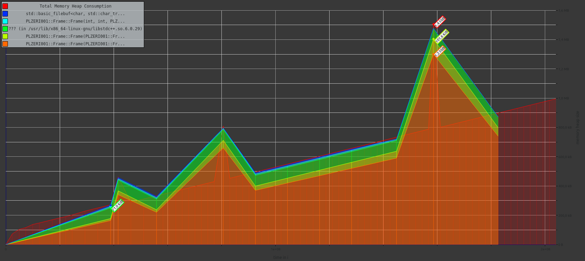
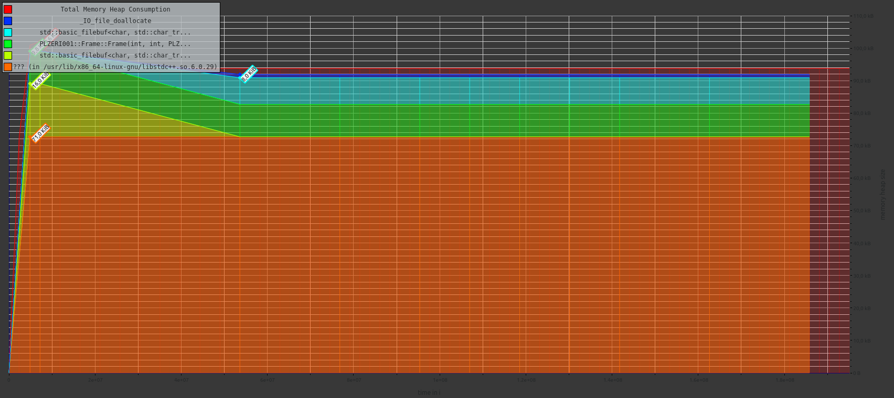

# PGM frame extractor

Extracts smaller subsections ('frames') from a larger PGM image, and outputs them to new files.
The frames are loaded in small increments, effectively panning through the large PGM image along a polyline.
They can be stitched together with FFMPEG to generate a video.

## Build & launch instructions

Run `make` inside the extracted folder. An executable should be built, to be run as `./extractor`.
Run `make clean` to remove the generated object files.

Run `ffmpeg -y -framerate 10 -i "<output_dir>/<output_name>-%05d.pgm" -pix_fmt rgb24 -vcodec png <video_name>.mp4` to generate the video.


## Command-line interface

The CLI has the format `extractor <input_file>.pgm <FLAGS>` where FLAGS are:

- s: frame_width, frame_height
- t: X1, Y1, X2, Y2
- p: N, X1, Y1, ..., XN, YN
- w: output_name, output_modifier ['none', 'invert', 'reverse', 'revinvert']
- o: output_directory


## Files

- `extractor.h`: Definitions, including Frame, FrameSequence, PGMMetadata and OutputSpec classes.
- `extractor.cpp`: Implements extractor definitions.
- `driver.cpp`: Implements main function with command line parser.
- `Makefile`: Build instructions for `make`
- `README.md`: Build instructions for you :)

## Memory analysis

I've run Valgrind to analyse the programme's memory usage. For the simple case (and using the sloan image), the memcheck
tool gives the following summary:
```
==47553== HEAP SUMMARY:
==47553==     in use at exit: 0 bytes in 0 blocks
==47553==   total heap usage: 30,128 allocs, 30,128 frees, 4,034,799 bytes allocated
==47553== 
==47553== All heap blocks were freed -- no leaks are possible
==47553== 
==47553== ERROR SUMMARY: 0 errors from 0 contexts (suppressed: 0 from 0)
```
Visualising the total heap memory during the runtime of the programme (using massif-visualizer) gives the following graph (peaking at 1.4MiB):

The frame parser works identically without storing the frames in a huge vector, showing a much better profile when commenting out
references to the unnecessary array of frames (peaking at 99.6KiB running the same example):
